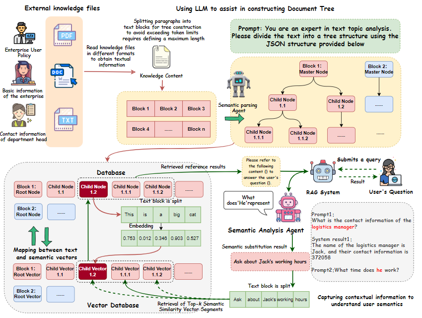
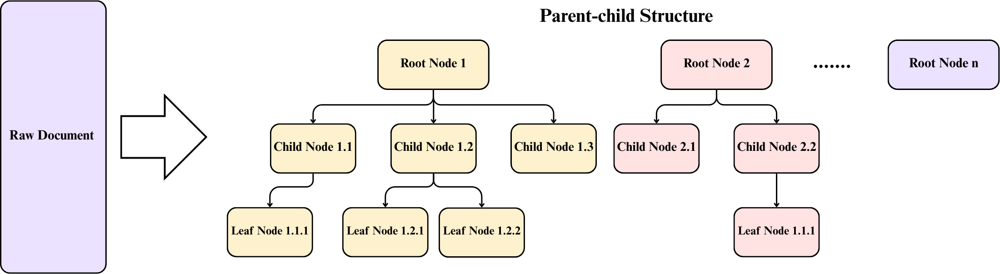
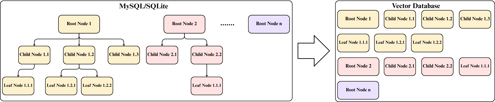
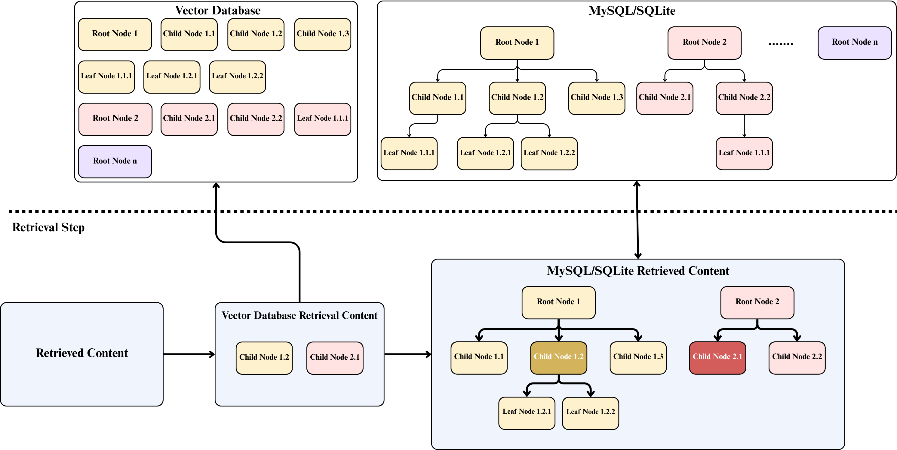

# DTRAG: A Tree-Structured High-Precision Retrieval-Augmented Generation Method for E-commerce Applications

## Overview

DTRAG is a novel framework that enhances Retrieval-Augmented Generation (RAG) systems through hierarchical document structuring. This project addresses the limitations of traditional RAG approaches by introducing a tree-based document representation that significantly improves retrieval accuracy and response quality in domain-specific question-answering systems.

## Key Features

### 🌳 Document Tree Structure
- **Hierarchical Knowledge Organization**: Implements a tree-based representation that captures semantic relationships between text segments
- **Semantic Chunking**: Uses advanced LLMs to intelligently partition documents into logically coherent units
- **Multi-level Abstraction**: Organizes content at different granularity levels to preserve contextual relationships

### 🎯 Enhanced Retrieval Performance
- **Improved Recall**: Achieves superior retrieval coverage compared to traditional fixed-length chunking
- **Better Ranking**: Higher Mean Reciprocal Rank (MRR) through structured semantic matching
- **Reduced Fragmentation**: Mitigates semantic disintegration common in conventional chunking methods

### 🚀 E-commerce Application
- **Domain-Specialized QA**: Tailored for customer service applications in e-commerce
- **Knowledge Integration**: Effectively incorporates domain-specific corpora and external knowledge
- **Accurate Responses**: Enhanced answer accuracy through structured retrieval

## Architecture



*Figure 1: Overall system architecture of DTRAG framework*

Figure 1 illustrates the overarching logical architecture of the system, while Figures 2, 3, and 4 delve into the specifics of its core tree-based retrieval mechanism. The architecture is structured around a layered pipeline, comprising three primary stages: Data Preprocessing, Vector Retrieval, and Intelligent Generation. Central to this design is the Tree-based Retrieval layer, which bridges the other stages by constructing a hierarchical document index and performing multi-path semantic search to ensure the integrity and accuracy of the contextual information passed to the generator.



*Figure 2: Construction of the Document Tree.*



*Figure 3: Storage of the Document Tree.*



*Figure 4: Knowledge Retrieval in DTRAG Architecture.*


## Installation

```bash
# Clone the repository
git clone https://github.com/Thedaizheng/DTRAG.git
cd DTRAG

# Install dependencies
pip install -r requirements.txt

# Set up environment variables
cp .env.example .env
# Edit .env with your API keys and configuration
```

## Instructions

For different directories in the project, different LLMs and Embedding models are selected accordingly. Therefore, projects with different directory structures yield varying results, but their overall approach is largely similar

## Example

For example, if the user needs to use the GPT-4o model and the embedding model of text-embedding-ada-002, the following is a sequence of user operations

- **Knowledge base upload**: First, place your own knowledge base in the project directory, with the path being DTRAG_GPT4o_ADA/rag/kdb/doc. Under this path, the project provides two demo-level knowledge bases, which users can modify according to their own needs

- **Initialize database and vector database**: Initialize relevant libraries through the rag_ctrl.py file

```bash
cd  DTRAG_GPT4o_ADA
python rag_ctrl.py init
```

- **Perform tree-structured partitioning of DTRAG**: The existing knowledge base content is segmented according to the algorithm logic of DTRAG, and the data is filled into the database and vector database

```bash
python rag_ctrl.py add_doc
```

- **Run the project**: Initiate the project for human-computer interaction

```bash
python chatbot_manager.py rag
```


